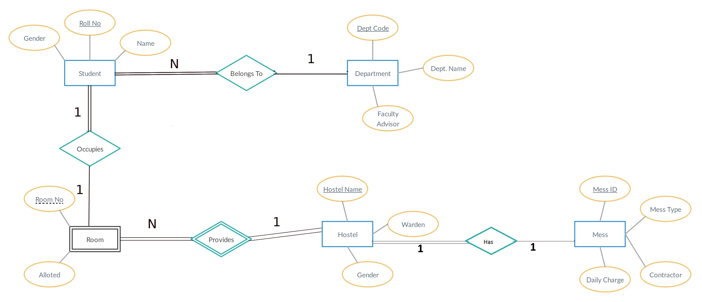

# Hostel-Allotment-Portal

## Setup instructions
```
sudo apt install python3
sudo apt install python3-pip
sudo apt install mysql-server
sudo apt install libmysqlclient-dev
pip3 install -r req.txt
- Setup mysql and configure a new user before continuing
- nano ~/.my.cnf ------- then add the following to the file
  - [client]
  - user = sql_username
  - password = your_password
- Run mysql: mysql
  - create database hostels
python3 manage.py makemigrations
python3 manage.py migrate
python3 manage.py createsuperuser
  - fill in admin login details
- To populate with default data: python3 setup_script.py
python3 manage.py runserver
- Default Login Dertails for Chief Warden:
  - Username : chief_warden
  - Password : warden@hostels

```
## ER Diagram

- 

## Relation Schema

- 
